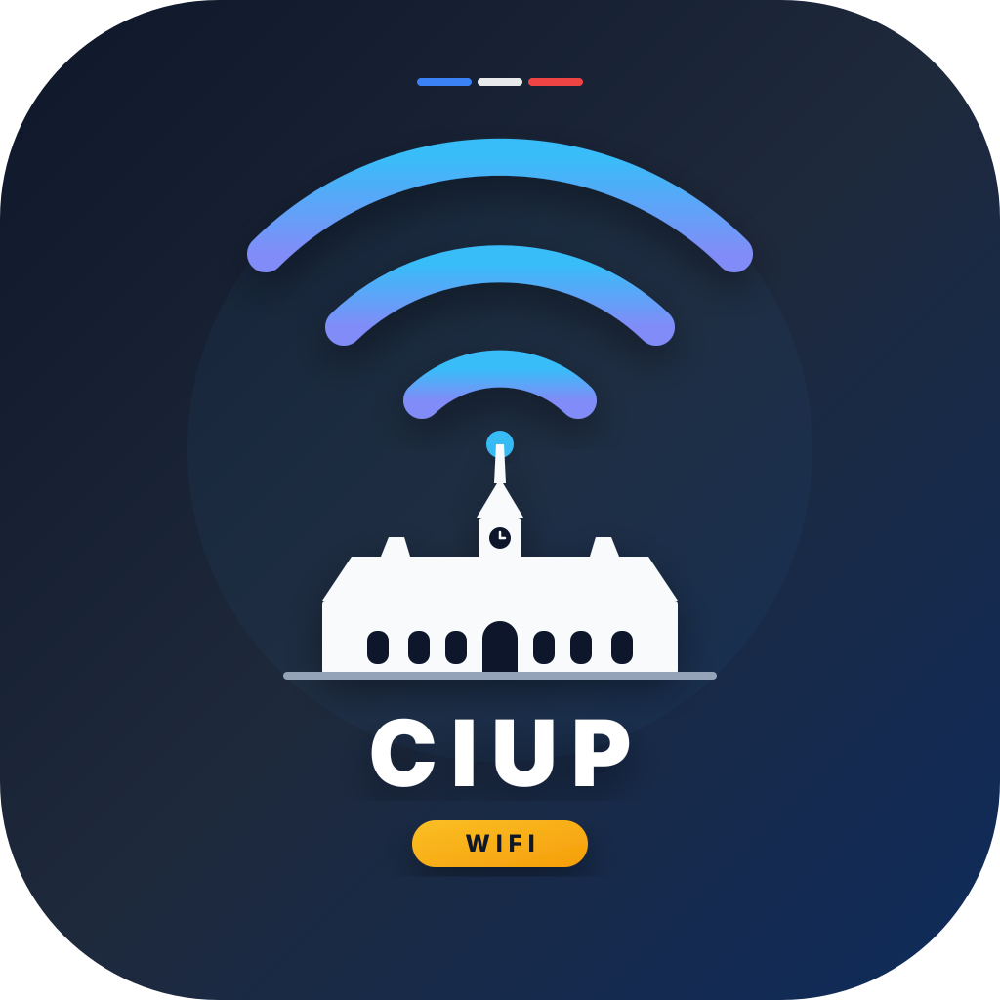

# CiupWifi 📶

  

  <b>Conexión automática a la red Wi-Fi "WifiCity" de la Cité internationale universitaire de Paris (CIUP).</b> 
  <i>Mantente conectado sin tener que escribir tu usuario y contraseña todo el día.</i>

  <a href="README.md">English</a> •
  <a href="README.fr.md">Français</a> •
  <a href="README.es.md"><b>Español</b></a> •
  <a href="README.zh.md">中文</a> •
  <a href="README.ko.md">한국어</a> •
  <a href="README.de.md">Deutsch</a>

> [!WARNING]
> **Aviso importante (Herramienta no oficial)**: Esta es una aplicación comunitaria independiente creada por un estudiante residente. **NO es** una aplicación oficial ni está afiliada a la administración o al departamento técnico de la CIUP.

---

## 🤔 ¿Para qué sirve esta app? (Propósito)

Si vives en la CIUP y usas la red Wi-Fi (**WifiCity**), ya conoces la molestia:
- Cada pocas horas, la sesión caduca y el internet se corta repentinamente.
- Tienes que abrir el navegador, esperar a que cargue la página y volver a escribir tu usuario y contraseña.
- Mientras estudias, ves una serie o estás en videollamada, la conexión se interrumpe sin previo aviso.

**CiupWifi soluciona esto por completo.**  
Una vez instalada, la aplicación funciona de forma silenciosa en segundo plano en tu ordenador o móvil. Se encarga de conectarte al Wi-Fi automáticamente y calcula cuándo suele cortarse la red para renovar tu sesión *antes* de que te quedes sin conexión.

---

## 🚀 Cómo usarla (3 pasos sencillos)

Solo tienes que configurarla **una sola vez**:

1. **Conéctate** a la red Wi-Fi de la residencia llamada **WifiCity**.
2. **Abre CiupWifi**, escribe tu **Usuario** y **Contraseña** del campus y haz clic en **Connect**.
3. **¡Listo!** Ya puedes cerrar la ventana.
   - En PC o Mac, la aplicación seguirá activa silenciosamente en la barra de tareas (junto al reloj).
   - Cuando tu conexión esté a punto de caducar, se renovará sola sin que tengas que hacer nada.

---

## 📥 Descarga

Descarga la versión para tu dispositivo desde la **[Página de versiones en GitHub](https://github.com/seojihyuk26/CiupWifi/releases/latest)**:

| Tu dispositivo | Archivo | Instalación fácil |
|---|---|---|
| **PC con Windows** | `CiupWifi_x.x.x_x64-setup.exe` | Descarga, haz doble clic para instalar y ábrelo. |
| **Mac (Apple)** | `CiupWifi_x.x.x_universal.dmg` | Abre el archivo y arrastra `CiupWifi` a la carpeta Aplicaciones. *(Si aparece aviso de seguridad: clic derecho > **Abrir**)* |
| **Móvil Android** | `app-universal-release-unsigned.apk` | Descarga e instala el archivo APK en tu teléfono. |
| **iPhone / iPad** | [`wifiLogin.js`](wifiLogin.js) (Script) | Instala [Orion Browser](https://kagi.com/orion/) o la extensión [Userscripts para Safari](https://apps.apple.com/app/userscripts/id1463298887) y añade el script `wifiLogin.js`. |

---

## 🔒 ¿Está segura mi contraseña?

**Sí, al 100%.**
- Tus datos se guardan **únicamente dentro de tu propio dispositivo**.
- Ninguna información se envía a servidores externos ni a los creadores de la app.
- La aplicación solo se comunica directamente con la página de inicio de sesión de la residencia (`10.254.0.254`).
- Todo el código es libre, abierto y transparente.

---

## 🙏 Agradecimientos y Referencias

Este proyecto se basa en investigaciones y herramientas previas de la comunidad de residentes de la CIUP:
- **[Thomas-dd3/WifiCity_captiveportal](https://github.com/Thomas-dd3/WifiCity_captiveportal)**: Extraordinario trabajo en scripts de automatización para Windows y Linux que descubrió el uso del puerto `1000` y los tokens `magic` de FortiGate.
- **[Gist de Ranadeep Biswas](https://gist.github.com/rnbguy/6f574caa6b3535162a20750cb1777a09)**: Script shell original de Linux para iniciar sesión en WifiCity.

CiupWifi adapta estas soluciones técnicas en una aplicación visual moderna e intuitiva para el día a día de todos los estudiantes.

---

## 📄 Licencia

Distribuido bajo la [Licencia MIT](LICENSE).
